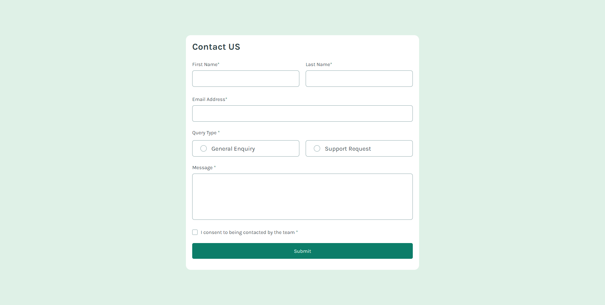

# Frontend Mentor - Contact form solution

This is a solution to the [Contact form challenge on Frontend Mentor](https://www.frontendmentor.io/challenges/contact-form--G-hYlqKJj). Frontend Mentor challenges help you improve your coding skills by building realistic projects.

## Table of contents

- [Overview](#overview)
  - [The challenge](#the-challenge)
  - [Screenshot](#screenshot)
  - [Links](#links)
- [My process](#my-process)
  - [Built with](#built-with)
  - [Continued development](#continued-development)
- [Author](#author)

## Overview

### The challenge

Users should be able to:

- Complete the form and see a success toast message upon successful submission
- Receive form validation messages if a required field has been missed
- Complete the form only using their keyboard
- Have inputs, error messages, and the success message announced on their screen reader
- View the optimal layout for the interface depending on their device's screen size
- See hover and focus states for all interactive elements on the page

### Screenshot

### Links

- Solution URL: [dvd1337/contact-form/src](https://github.com/dvd1337/contact-form)
- Live Site URL: [dvd1337.github.io/contact-form](https://dvd1337.github.io/contact-form)

## My process

### Built with

- Semantic HTML5 markup
- CSS custom properties
- Flexbox
- CSS Grid
- Mobile-first workflow
- [React](https://reactjs.org/) - JS library

### Continued development

I want to improve my skills in the prototype mechanics of react, it's been very useful, and above all I want to start thinking faster.

## Author

- Website - [David Santos](https://dvd1337.github.io/sites/)
- Frontend Mentor - [@dvd1337](https://www.frontendmentor.io/profile/dvd1337)
- Twitter - [@DillNTC](https://x.com/DiIlNTC)
